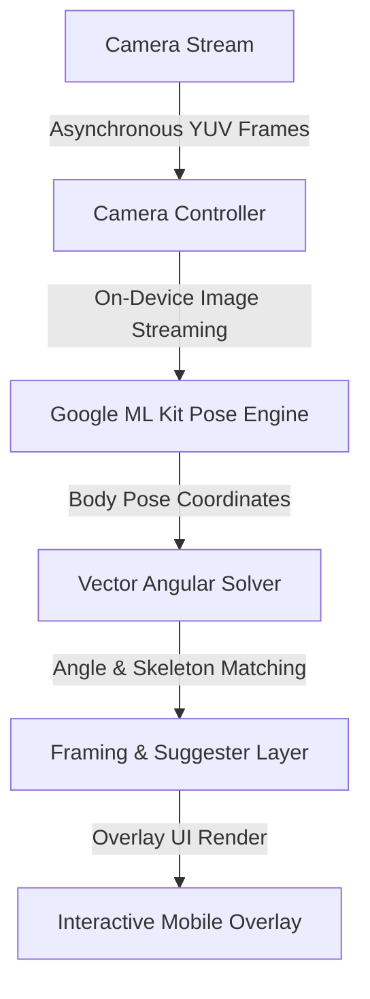

# 📸 Pose AI Camera — Intelligent Mobile Framing

[](https://flutter.dev/)
[](https://developers.google.com/ml-kit)
[](https://www.android.com/)

A premium, high-performance mobile application engineered to assist photographers and content creators by suggesting perfect camera framings and body postures in real-time, leveraging on-device ML pose estimation models.



## ⚡ Core Features
- **On-Device Computer Vision**: Leveraging Google ML Kit Pose Detection for real-time skeleton tracking at 30+ FPS.
- **Asymmetric Vector Angle Solver**: Translates coordinate maps into exact physical posture angular discrepancies.
- **Real-Time Interactive Skeleton Overlay**: Smooth rendering of dynamic joint lines on high-resolution camera canvases.

## 🛠 Architecture
- **Language Core**: Dart 3.x
- **UI Platform**: Flutter Framework
- **Hardware Integration**: Camera plugins with custom background frame isolator streams.
- **Inference Layer**: Google ML Kit Pose ML Engine.

## 🚀 Installation & Setup
1. Ensure Flutter is installed and configured on your system PATH.
2. Initialize dependencies:
   ```bash
   flutter pub get
   ```
3. Compile and execute on connected mobile device:
   ```bash
   flutter run --release
   ```

## 📜 License
MIT License. Created by Kalyan Reddy.
